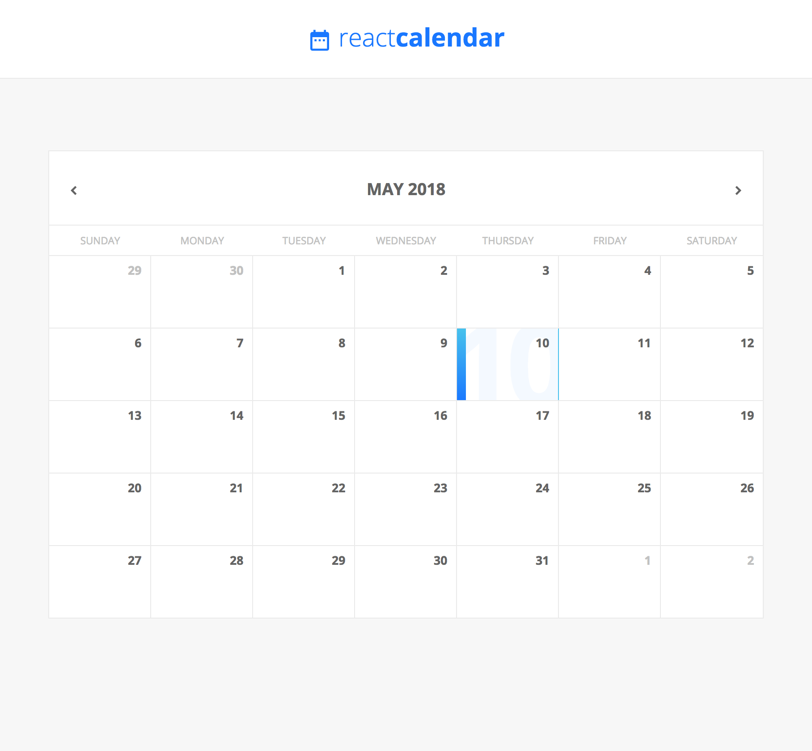

# React calendar component

[Read the blog](https://blog.flowandform.agency/create-a-custom-calendar-in-react-3df1bfd0b728) about how to create and expand custom React calendar component

To start it in your environment, clone the repo and while in folder, execute following commands

~~~
npm install
npm run start
~~~

More at [Moodydev.io](http://moodydev.io "Moodydev")
